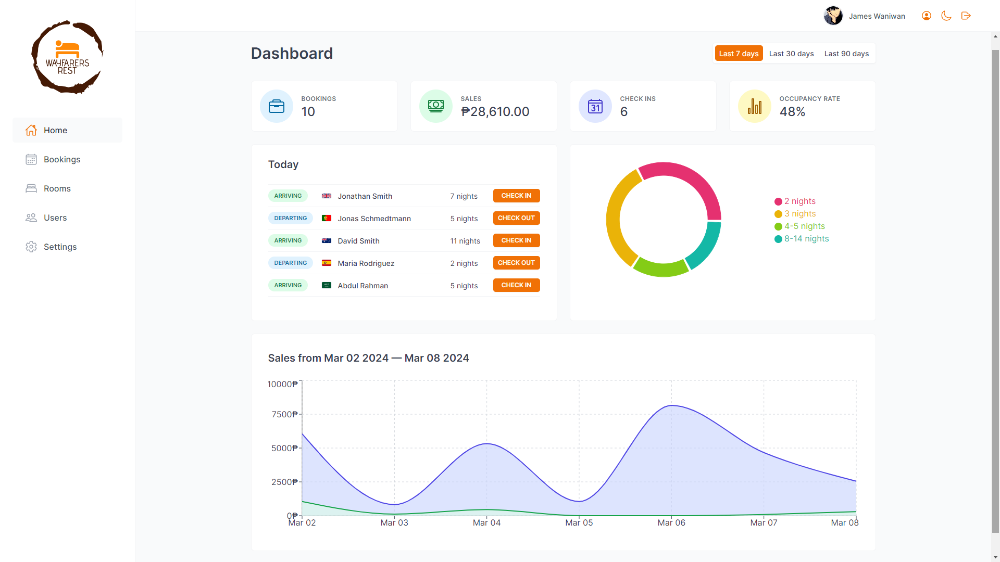

<!-- PROJECT LOGO -->
<br />
<h1 align="center">Wayfarers Rest</h1>

<!-- ABOUT THE PROJECT -->

## About The Project

<p align="center">
Wayfarers Rest is an hotel management web application. Developed using react, this is web app designed for the employees of Wayfarers Rest. It allows them to manage the operations such as booking management, customer information, room availability, and other administrative tasks.
</p>



<!-- APPLICATION'S FEATURES -->

## 📝 Features

- Authentication and Authorization

  - Users accessing the application are designated hotel employees who must log in to perform tasks.
  - New user registrations are restricted to within the application to ensure that only authorized hotel employees can obtain accounts.
  - Users have the capability to upload an avatar, update their name, and change their password.

- Room Management

  - The application features a table presenting all the rooms, showcasing room photos, names, capacities, prices, and current discounts.
  - Users can edit, delete and create new rooms.

- Booking Management

  - The application provides a table exhibiting all bookings, displaying arrival and departure dates, status, paid amounts, as well as the room and guest information.
  - Booking statuses can be categorized as "unconfirmed" (booked but not yet checked in), "checked in", or "checked out", and the table is filterable based on these statuses.
  - Additional booking data includes guest count, duration of stay, guest observations, and breakfast booking details.

- Check-in and Check-out

  - Users have the ability to delete, check-in, or check out bookings as guests arrive.
  - Bookings may not have been paid upon guest arrival; therefore, users are required to confirm payment acceptance (handled externally) on check-in.
  - Guests can opt to add breakfast for their entire stay during check-in if not previously arranged.

- Sales Statistics

  - The application's home screen functions as a dashboard, presenting essential information for the last couple of days
    - A list of guests checking in and out on the current day, users can also checked-in or checked-out guests from here.
    - Statistics on recent bookings, sales, check-ins, and occupancy rate.
    - A chart illustrating daily hotel sales, encompassing both total sales and extras sales (currently limited to breakfast).
    - A chart statistics depicting stay durations, a pivotal metric for the hotel's operations.

- Settings Customization

  - Users can define several application-wide settings, including breakfast pricing, minimum and maximum nights per booking, and maximum guests per booking.

- App dark mode.

  - The application offers a dark mode option for enhanced visual comfort and flexibility.

<!-- TECHNOLOGY USED -->

## 👨‍💻 Technology Used

The Wayfarers Rest Web Application is built using the following technologies and libraries:

- **React**: React is a JavaScript library for building dynamic user interfaces efficiently, allowing developers to create reusable UI components and manage application state effectively.

  - **React Query**: React Query is a data-fetching library designed specifically for React applications. It simplifies managing and caching asynchronous data queries from APIs or other sources, enhancing application performance and user experience.

  - **React Router**: React Router is a popular routing library for React applications, enabling seamless navigation and URL routing within single-page applications (SPAs) with features like nested routing and route guarding.

  - **React Hook Form**: React Hook Form is a lightweight form library for React applications, offering a simple API based on React hooks for easy form creation, validation, and state management.

- **Supabase**: Supabase is an open-source alternative to Firebase, providing tools and services for building and scaling modern applications, including authentication, database management, and real-time updates.

- **Styled Components**: Styled Components is a CSS-in-JS library for React applications, allowing developers to write CSS styles directly within JavaScript code using tagged template literals, promoting modularity and reusability.

- **Vite**: Vite is a modern build tool optimized for JavaScript applications, offering features like hot module replacement, fast builds, and support for various frameworks, streamlining the development process without compromising performance.

<!-- LIVE DEMO -->

## 🚀 Live Demo

[https://wayfarers-rest.vercel.app/](https://wayfarers-rest.vercel.app/)

## 🎮 Demo Account

You can log in using the provided demo account details:

- **Email**: jameswaniwan@gmail.com
- **Password**: 12345678

<!-- CLIENT -->

## 🙍🏻‍♂️ Customer Portal

This is the employee portal of Wayfarest Rest. You can also check out the client app of Wayfarers Rest below. Both applications share the same database.

- **Customer Portal**: [https://wayfarers-rest-website.vercel.app/](https://wayfarers-rest-website.vercel.app/)

## 🛠 Installation Steps:

<p>1. Clone the repository</p>

```
git clone https://github.com/jcWani/wayfarers-rest.git
```

<p>2. Install required dependencies </p>

```
npm install
```

<p>3. Launch the development server</p>

```
npm run dev
```

<p>4. Open the application at</p>

```
http://localhost:5173
```

<!-- ACKNOWLEDGEMENTS -->

## Acknowledgments

This appplication was the main project and developed as part of the [Udemy course](https://www.udemy.com/course/the-ultimate-react-course) "The Ultimate React Course 2024: React, Redux & More" by [Jonas Schmedtman](https://twitter.com/jonasschmedtman).
